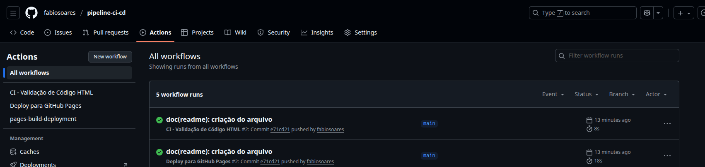
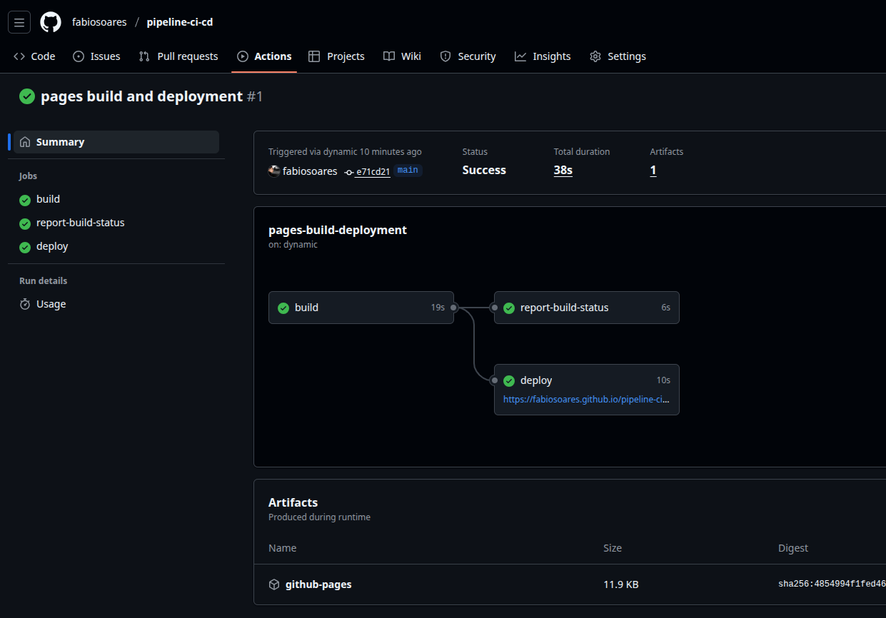
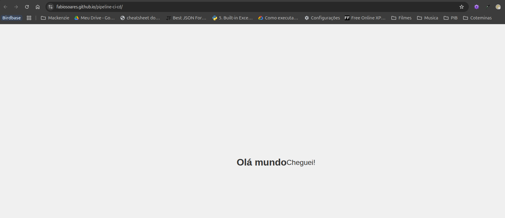

# 💻 Pipeline CI/CD para Validação e Deploy de Código HTML

## 🧑‍🎓 Aluno

- Nome: Fabio Silva Soares
- RA: 10729833

## 🎓 Curso

- Curso: Devops & Data Ops
- Instituição: Universidade Presbiteriana Mackenzie
- Professor: Débora Paulo

## 🔍 Evidências da Execução

### ✅ Workflow no GitHub Actions

### ⏱️ Tempo de Execução do Workflow

### 🌐 Site Publicado
[https://fabiosoares.github.io/pipeline-ci-cd/](https://fabiosoares.github.io/pipeline-ci-cd/)

## 📜 Análise do Projeto

O principal ganho na vida de um engenheiro de dados, e de qualquer  profissional de TI, é a automação de processos repetitivos, com o objetivo de aumentar a eficiência, com redução de erros humanos.
Desta forma podemos acelerar a entrega de produtos e serviços, sem o sacrifício da qualidade, se os devidos testes e validações forem implementados no processo de automação.